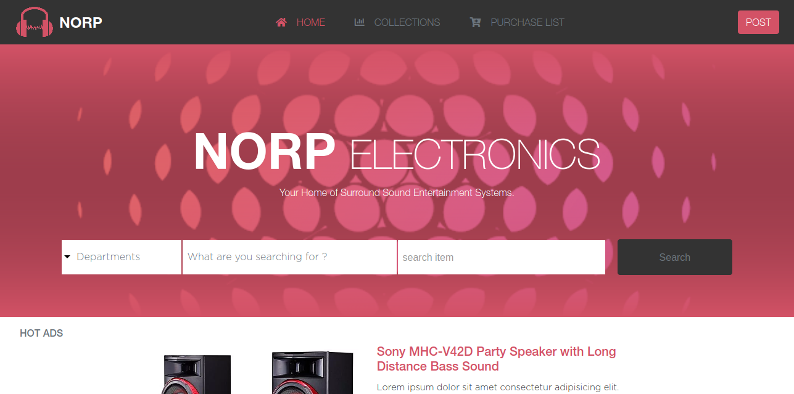

# Sound-Electronics-store

>This project is my HTML & CSS3 capstone project in the Microverse Program.

In this project, I the author built an online Electronics store webpage whose design was inspired by a prototype  built by Mohammed Awad at the [Behance Webpage](https://www.behance.net/gallery/24796463/ZATTIX)

The purpose of the project was to demonstrate my understanding and mastery of a range of  HTML and CSS3 concepts, from Backgrounds and Gradients to Floats and Positioning to name a few, and my ability to work with CSS Frameworks such as Twitter Bootstrap, learned throughout the course of the HTML and CSS3 curriculum of the Microverse Program.




The project has 2 pages, The homepage above and a Search page which can be accessed by clicking on the 'Search' button seen in the page above.

## Built With
- HTML
- CSS
- Font Awesome
- CSS Framework (Twitter Bootstrap)

## Live Demo

[Live Demo Link](https://rawcdn.githack.com/RNtaate/Sound-Electronics-store/e16b34e1fba79434a6eb70bdf5640755c8525166/index.html)


## Getting Started
To get a local copy of this repository, please run the following commands on your terminal

```
$ cd <folder>
```

```
$ git clone https://https://github.com/RNtaate/Sound-Electronics-store.git
```

## Authors

👤 **Roy Ntaate**

- Github: [@RNtaate](https://github.com/RNtaate)
- Twitter: [@RNtaate](https://twitter.com/RNtaate)
- Linkedin: [roy-ntaate](https://linkedin.com/in/roy-ntaate)


# 🤝 Contributing

Contributions, issues and feature requests are welcome!

Feel free to check the [issues page](https://github.com/RNtaate/Sound-Electronics-store/issues).

## Show your support

Give a ⭐️ if you like this project!

## Acknowledgments
- UI Design Credit goes to [Mohammad Awad at www.Behance.net](https://www.behance.net/gallery/24796463/ZATTIX)
- The project was inspired by the [Microverse](https://www.microverse.org/) program.

## 📝 License

This project is [MIT](lic.url) licensed.
